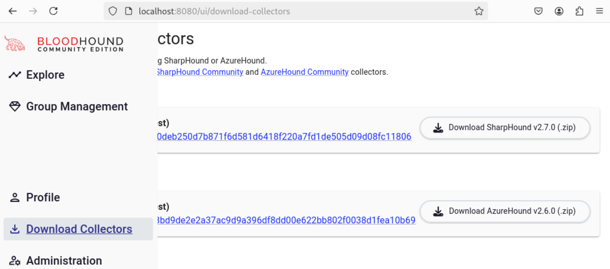
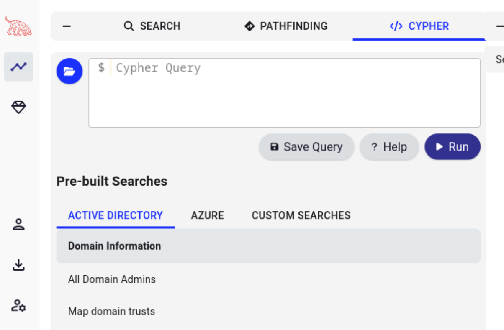

## Active Directory

### Bloodhound

[Bloodhound](https://github.com/SpecterOps/BloodHound.git) helps us analyze Active Directory (AD) misconfigurations.
AD can be a great tool for administrators trying to manage corporate IT resources, but it is also quite complex.
And with complexity comes: misconfigurations!

#### Install:
```bash
wget https://github.com/SpecterOps/bloodhound-cli/releases/latest/download/bloodhound-cli-linux-amd64.tar.gz
tar -xvzf bloodhound-cli-linux-amd64.tar.gz
./bloodhound-cli install
# Note the URL and credentials!
./bloodhound-cli up
```

#### Use:
With the tool's Docker containers up and running, browse to [http://localhost:8080](http://localhost:8080).
Use `admin` and the password provided in the `install` step; you will be forced to change it.

Once logged in, _Download Collectors_ gives .exe downloads to collect data from on-premise Active Directory and Azure:



1. Run either or both collectors against your environment
1. Go to _Administration_ | _File Ingest_ and upload anything you've collected
1. Use _Explore_ to analyze specific groups, users, GPOs, computers, etc. (AD objects)
1. Use standard queries to find _All Kerberoastable users_, _Shortest Paths to Domain Admin_, _Principals with DCSync privileges_, or anything else that looks dangerous



### Impacket

```bash
sudo apt install pipx
python3 -m pipx install impacket
pipx ensurepath
```

### Certipy

```bash
git clone https://github.com/ly4k/Certipy.git
cd Certipy
python3 -m venv certipy-venv
source certipy-venv/bin/activate
pip install certipy-ad
```

https://github.com/ly4k/Certipy.git


### Share Finders