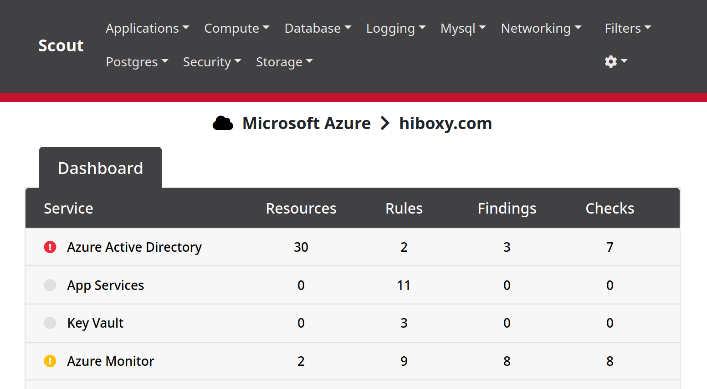

## Cloud Assets

Nearly every organization has a presence in public clouds, and there are SO many ways to misconfigure each of them!
Use vendor security dashboards, [ScoutSuite](https://github.com/nccgroup/ScoutSuite), [Prowler](https://github.com/prowler-cloud/prowler?tab=readme-ov-file), and anything else that gives you useful information.

### ScoutSuite

Scout is a multi-platform tool that checks for security misconfigurations in the most common cloud platforms.
It's a great first pass check for open buckets, firewall rules, MFA, etc.

#### Install

`scout` exists as a Python package, so we can install it with pip:

```bash
cd
python3 -m venv scout
source scout/bin/activate
pip3 install scoutsuite
```

#### Use

Generally, once the package is installed, we can start it like this:

```bash
source ~/scout/bin/activate
scout
# When complete, close the terminal or:
deactivate
```

Syntax varies some across [AWS](https://github.com/nccgroup/ScoutSuite/wiki/Amazon-Web-Services), [Azure](https://github.com/nccgroup/ScoutSuite/wiki/Azure), [GCP](https://github.com/nccgroup/ScoutSuite/wiki/Google-Cloud-Platform), and the other cloud providers.
Also, **importantly**, there are specific access/read requirements for the account Scout runs under.
Check the tool's documentation to ensure it can access the info it needs to assess your environment.



### CSP Dashboards

Vendor security dashboards are absolutely worth checking.
Like Scoutsuite, there will be misses and false positives, but be certain to at least check for the low-hanging fruit.


